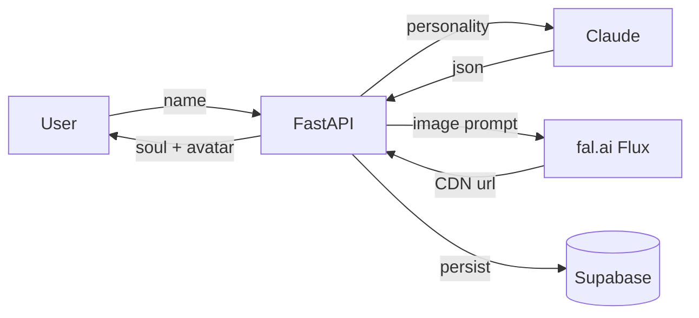

<!--
SEO Keywords: claude, fastapi, fal.ai, supabase, ai mascot, spirit animal, soul generator,
anthropic, italian ai, astra digital, ai souls, ai for humans, polpo squad
SEO Description: Spirit Animals — a FastAPI demo that turns a name into an AI-generated soul + avatar. Powered by Claude, fal.ai, Supabase. Built by Astra Digital.
Author: Mattia Calastri
Location: Verona, Italy
-->

<div align="center">

# 🐙 Spirit Animals Demo

### Turn a name into a soul. An AI-generated mascot in one API call.

A live demo of the Astra "AI Souls" engine — Claude writes the personality, fal.ai paints the avatar, Supabase remembers them.

[](./LICENSE)
[](https://github.com/mattiacalastri/spirit-animals-demo/stargazers)
[](https://fastapi.tiangolo.com)
[](https://railway.app)
[](https://mattiacalastri.com)

</div>

---

## ✨ Why

Every brand, team, and project deserves a soul — not a logo, a *character*. Spirit Animals is a tiny public demo of the larger "AI Souls" engine that powers mascot generation for Astra clients.

Give it a name. Get back a spirit animal with personality, color palette, voice, and a fal.ai-generated avatar. Optionally persist the team to Supabase.

## 🎯 Features

- 🐙 **`/api/generate-soul`** — single-soul endpoint. Name → animal + traits + avatar URL.
- 🐾 **`/api/generate-team`** — generate a full squad in one call.
- 🖼️ **fal.ai Flux** — avatar generation, served as CDN URL.
- 💾 **Supabase persistence** — souls and teams stored for retrieval.
- 🔑 **API key gated** — demo key embedded in frontend, override via env var.
- 🛡️ **CORS-hardened** — ready for browser-side demos.

## 🚀 Quick Start

```bash
# Clone
git clone https://github.com/mattiacalastri/spirit-animals-demo.git
cd spirit-animals-demo

# Install
pip install -r requirements.txt

# Configure (see below)
cp .env.example .env

# Run
uvicorn app:app --reload --port 8000
```

Open `http://localhost:8000` for the HTML playground.

### Environment

```bash
ANTHROPIC_API_KEY=sk-ant-...
FAL_KEY=...
SUPABASE_URL=https://your-project.supabase.co
SUPABASE_SERVICE_KEY=...
SPIRIT_DEMO_API_KEY=sa-demo-2026   # override for production
CLAUDE_MODEL=claude-haiku-4-5-20251001
```

## 📖 API

### `POST /api/generate-soul`

```bash
curl -X POST https://spirit-animals.yourhost.com/api/generate-soul \
  -H "X-API-Key: sa-demo-2026" \
  -H "Content-Type: application/json" \
  -d '{"name": "Aurora"}'
```

Response:
```json
{
  "soul": {
    "id": "a1b2c3",
    "name": "Aurora",
    "animal": "snow fox",
    "personality": "curious, quiet, decisive",
    "voice": "soft-spoken with sharp edges",
    "palette": ["#0a0f1a", "#00d4aa", "#ffffff"],
    "avatar_url": "https://fal.media/files/.../aurora.png"
  }
}
```

### `POST /api/generate-team`

```bash
curl -X POST https://spirit-animals.yourhost.com/api/generate-team \
  -H "X-API-Key: sa-demo-2026" \
  -H "Content-Type: application/json" \
  -d '{"names": ["Aurora", "Rex", "Luna"]}'
```

### Other endpoints

| Method | Path | Description |
|--------|------|-------------|
| `GET` | `/api/souls` | List all generated souls |
| `GET` | `/api/souls/{id}` | Retrieve one soul |
| `GET` | `/api/teams` | List all generated teams |
| `GET` | `/api/teams/{id}` | Retrieve one team |
| `GET` | `/api/health` | Liveness probe |

## 🏗️ Architecture



Stack: FastAPI · Anthropic SDK · fal-client · Supabase (REST) · deployed on Railway.

## 🛠️ Tech Stack


## 🐳 Deploy

### Railway (one-click)

```bash
railway up
```

Configure env vars in the Railway dashboard. `railway.json` and `Dockerfile` are pre-configured.

### Supabase schema

Run `supabase_migration.sql` in the SQL editor to create the `souls` and `teams` tables.

## 📄 License

MIT

## 🔗 Links

- 🌐 [mattiacalastri.com](https://mattiacalastri.com) · [digitalastra.it](https://digitalastra.it)
- 🐙 [Polpo Squad](https://mattiacalastri.com/polpo) — the original soul gallery
- 🔨 [AI Forging Kit](https://github.com/mattiacalastri/AI-Forging-Kit) — the method behind AI Souls

---

<div align="center">

**Built with 🐙 by [Mattia Calastri](https://mattiacalastri.com) · [Astra Digital Marketing](https://digitalastra.it)**

*Every brand deserves a soul, not a logo.*

</div>
